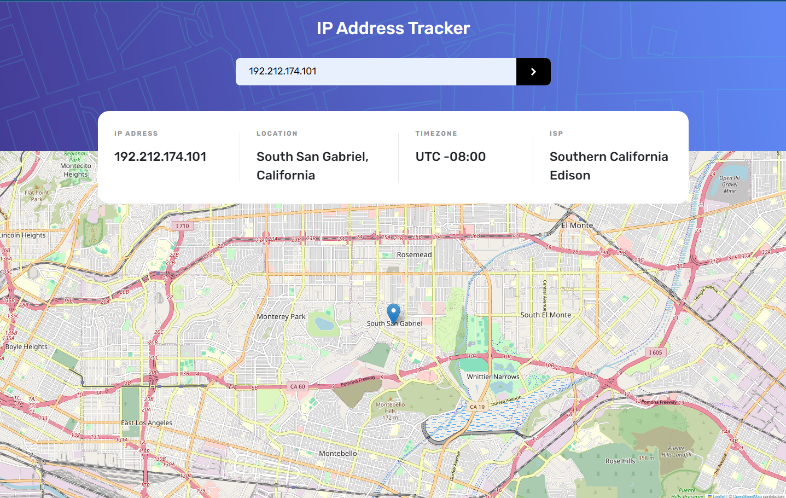
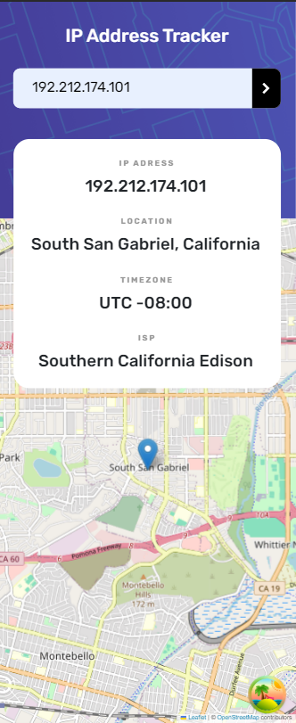

# Frontend Mentor - IP address tracker solution

This is a solution to the [IP address tracker challenge on Frontend Mentor](https://www.frontendmentor.io/challenges/ip-address-tracker-I8-0yYAH0). Frontend Mentor challenges help you improve your coding skills by building realistic projects.

## Table of contents

- [Overview](#overview)
  - [The challenge](#the-challenge)
  - [Screenshots](#screenshots)
- [Tech Stack](#tech-stack)
- [Author](#author)

## Overview

### The challenge

Users should be able to:

- View the optimal layout for each page depending on their device's screen size
- See hover states for all interactive elements on the page
- See their own IP address on the map on the initial page load
- Search for any IP addresses or domains and see the key information and location

### Screenshots

| Desktop                          | Mobile                         |
| -------------------------------- | ------------------------------ |
|  |  |

## Tech Stack

- [React](https://reactjs.org/)
- [react-query](https://tanstack.com/query/latest) - For remote state management
- [Leaflet](https://leafletjs.com/) - For map
- [react-hook-form](https://react-hook-form.com/) - For form management
- [Sass](https://sass-lang.com/)
- [Bootstrap](https://getbootstrap.com/)

## Author

- Frontend Mentor - [@Dogukanays](https://www.frontendmentor.io/profile/Dogukanays)
- Linkedin - [@dogukan-aysan](https://www.linkedin.com/in/dogukan-aysan/)
- Email - <dogukanaysan01@gmail.com>
